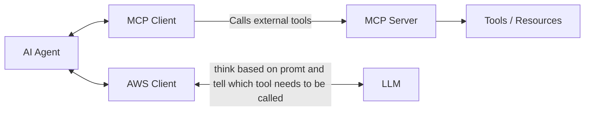

# local-mcp-server

## Overview
This repository contains the `local-mcp-server`, a project designed to provide a local server environment for managing MCP (Model-View-Presenter) architecture applications.

## Installation
To set up the project locally, follow these steps:

1. Clone the repository:
    ```bash
    git clone https://github.com/kumar-albert/local-mcp-server.git
    ```
2. Navigate to the project directory:
    ```bash
    cd local-mcp-server
    ```
3. Install the necessary dependencies:
    ```bash
    uv sync
    ```

## Usage
To start the local server, run:
```bash
make start-mcp-server
make start-agent
```

## Contributing
Contributions are welcome! Please open an issue or submit a pull request for any enhancements or bug fixes.

## License
This project is licensed under the MIT License - see the [LICENSE](LICENSE) file for details.

## Contact
For any inquiries, please reach out to the repository owner, kumar-albert.


## Architecture

